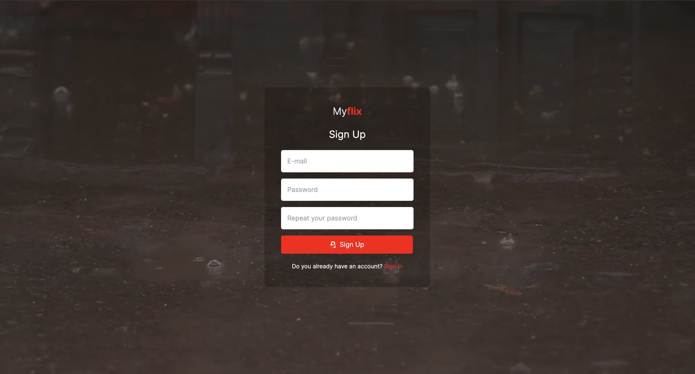

# MyFlix

## Description

`MyFlix` is an online streaming platform similar to `Netflix`, developed using ReactJS, TypeScript, and Firebase. The
application includes features such as sign-up and sign-in using Firebase on the backend, allowing users to sign in with
both email and Google.

## Getting Started

### Features

There are some features in this application,
Here are some features available in this application, where users can:

- Register using email and password.
- Log in using email & password, as well as log in using a Google account.
- On the dashboard page, users can view popular movies.
- Users can also choose from three available tabs: now playing, upcoming movies, and top-rated movies.
- The main feature of this application is providing users the flexibility to choose which movies they like and save them
  to their favorites.
- In the favorites section, users can remove movies they do not like.
- Additionally, this application includes a profile feature, where users can view their personal information. The
  application is also well-designed to be accessible via mobile devices.

### The Stack

This application is built using `ReactJS` for the frontend and `Firebase` for the backend, which is responsible for user
authentication, and i use [TMDB](https://www.themoviedb.org/) `API` for getting all of the movies.

### Development

Before you run the application, the first step you have to install [NodeJS](https://nodejs.org)
sfter installation completed, open your terminal or command prompt and type `node --version`.

to get this application you download the `zip` file into your local machine or you can
type this command :

```bash
git clone https://github.com/ivandi1980/myflix.git
```

on your terminal or command promt. after download completed, the open the folder `myflix` using
your IDE, then run `npm install` or `yarn install`.
then open your browser and type `http://localhost:3000`.

gere are some command that you can use to run the development server:

```bash
npm run dev
# or
yarn dev
# or
pnpm dev
# or
bun dev
```

### Screen Shoot

Here are some screen shoot of this application, start from

#### Sign Up

To use this application, first step you have to sign up, here is the UI Form below,
you can input your `email` and put your `password` & re-enter your `password` again
next you can see if you don't put anything one the textbox fields, it will throw an `error`.
but when your registration suceess you will see any `green alert` on top of the form.


### Sign In

After your registration success, next you'll be face this `login` page, here you can use
two options, first is login through your `email` and `password` or just login through
your `google` account.same as `sign up` page, in here you will find some features, like
`error alert`. this error will show up when something happen not as expected.
for example you put wrong credentials.
but if your credentials are match with the database then you will redirect to the `dashboard` page.


### Home

This is the `Home Page` or `Dashboard Page`, in here you can find some features like `popular movies`
`now playing`, `upcoming movies`, and `top rating movies`.
this page is full of data and some animation when you hover, or scroll up & down the page
the point is you can find a cool stuff in here.

on the `Navbar` you can view your `name, picture` and your `profile` too.
you can play the `video` on the hero section, you can scroll the card inside the `popular movies`


### Popular Movies

Actually the `popular movies` are lists of popular movies nowdays.
here you can find a good stuff, when you click one of these card then it will trigger
the modal, ang you can choose to `save` the movie into your `movie list` or not.
it's a cool stuff


### Favourites Movies

On this page, all your favorite movies will appear in a list format. If you wish to remove a movie, simply click the
delete button, and the movie will disappear from this page.


### Detail Movies
This is the modal that i created to show the details of the movie.


## Credit

This project was developed by [ivandjoh](https://www.linkedin.com/in/ivandjoh/) @2024.
